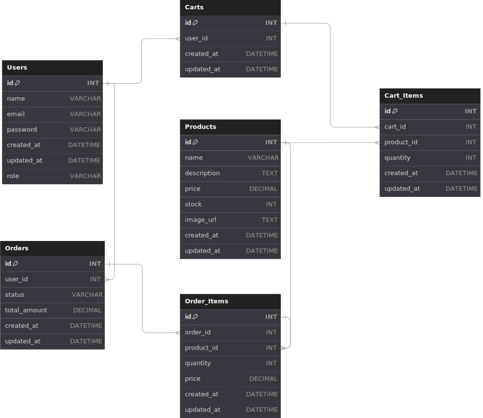

# RiangPlay

[RiangPlay](https://riang-play-fe.vercel.app//) is an online store for Kids and Babies wear.

Table of contents:

- [RiangPlay](#riangplay)
  - [Links](#links)
  - [Features](#features)
  - [ERD](#entity-relationship-diagram-erd)
  - [Endpoints](#rest-api-endpoints)

## Links

- Website/Frontend: <https://riang-play-fe.vercel.app/>
- Backend: <https://riang-play-be.onrender.com/>
- Repositories:
  - General: <https://github.com/Padillahirpan/riang-play-commerce>
  - Backend: <https://github.com/Padillahirpan/riang-play-be>
  - Frontend: <https://github.com/Padillahirpan/riang-play-fe>

Inspirations:

- <https://symautilized.com/>

## Features

- Home Page
  - Navbar
  - Hero Section
  - Products New Arrivals
- Register Page
- Login Page
- Product Page
  - Image
  - SKU (stock keeping until)
  - Name
  - Price
  - Description
  - Add to cart form: quantity input & add to cart button
- Product items to buy
  - Image, name, price, quantity, total (price x quantity)
  - Remove items
- Profile Page
  - Logout
- Cart Page
  - List cart
  - Remove cart (Not implemented)
  - Update cart (Not implemented)
- Link: continue shopping, go to products catalogue
- Link: checkout

## Entity Relationship Diagram (ERD)

## REST API Endpoints

- Production: `https://riang-play-fe.vercel.app/`
- Local: `http://localhost:3000`

### API Product

| Endpoint          | HTTP     | Permission    | Description          |
| ----------------- | -------- | ------------- | -------------------- |
| `/products`       | `GET`    | Public        | Get all products     |
| `/products/:slug` | `GET`    | Public        | Get product by slug  |
| `/products`       | `POST`   | Authenticated | Add new product      |
| `/products/:id`   | `DELETE` | Authenticated | Delete product by id |
| `/products/:id`   | `PUT`    | Authenticated | Update product by id |

### API Cart

| Endpoint        | HTTP     | Permission    | Description                          |
| --------------- | -------- | ------------- | ------------------------------------ |
| `/cart`         | `GET`    | Authenticated | Get all cart by user token           |
| `/cart`         | `POST`   | Authenticated | Add new product to the cart          |
| `/cart/:itemId` | `DELETE` | Authenticated | Remove a product from the cart by id |
| `/cart/:itemId` | `PUT`    | Authenticated | Update product on cart by id         |

### API Auth

| Endpoint         | HTTP   | Permission    | Description      |
| ---------------- | ------ | ------------- | ---------------- |
| `/auth/register` | `POST` | Public        | Register User    |
| `/auth/login`    | `POST` | Public        | Login User       |
| `/auth/me`       | `GET`  | Authenticated | Get User Profile |

### API User

| Endpoint | HTTP  | Permission    | Description  |
| -------- | ----- | ------------- | ------------ |
| `/users` | `GET` | Authenticated | Get all user |
